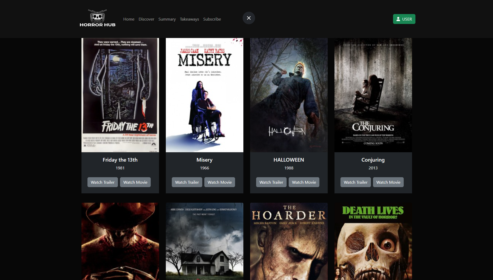

# HORROR HUB
Horror Hub yra internetinė filmų platforma, skirta mylėtojams, kurie mėgsta siaubo filmus. Ši programa suteikia galimybę žiūrėti platų siaubo filmų pasirinkimą, tarp jų naujausius hitus ir klasikinius šedevrus. Be to, ji taip pat leidžia vartotojams ziureti dalintis įspūdžiais su bendruomene ir gauti rekomendacijas pagal jų skonį.



## Naudojimas
Ši svetainė sukurta naudojant Bootstrap ir Sass. Ji naudoja Font Awesome ikonoms.

### Funkcijos

- Modernus išdėstymas su pasirinktais spalvomis/stiliais/fonais
- Atsakantis dizainas
- naršymo meniu su stiliaus pakeitimais
- Bootstrap 
- Formos ir įvesties laukų stiliai
- rikiavimas pagal filmo pavadinimo stulpelį
- galimybę ieškoti filmų

#### Prielaidos

Prieš paleisdami programą, įsitikinkite, paleidziant su

- Node.js
- npm
- MongoDB

#### Instaliacija

1. Nusiklonuokite šį repozitoriją į savo kompiuterį.
2. Atsidarykite terminalą ir pakeiskite direktoriją į klonuotą repozitoriją.
3. Įvykdykite šias komandas:

```bash
npm install sass @fortawesome/fontawesome-svg-core @fortawesome/free-brands-svg-icons @fortawesome/free-solid-svg-icons @fortawesome/react-fontawesome bootstrap
npm run dev
node server.js
